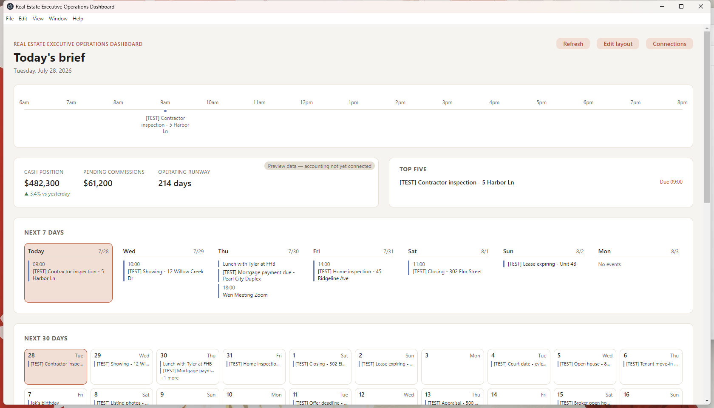
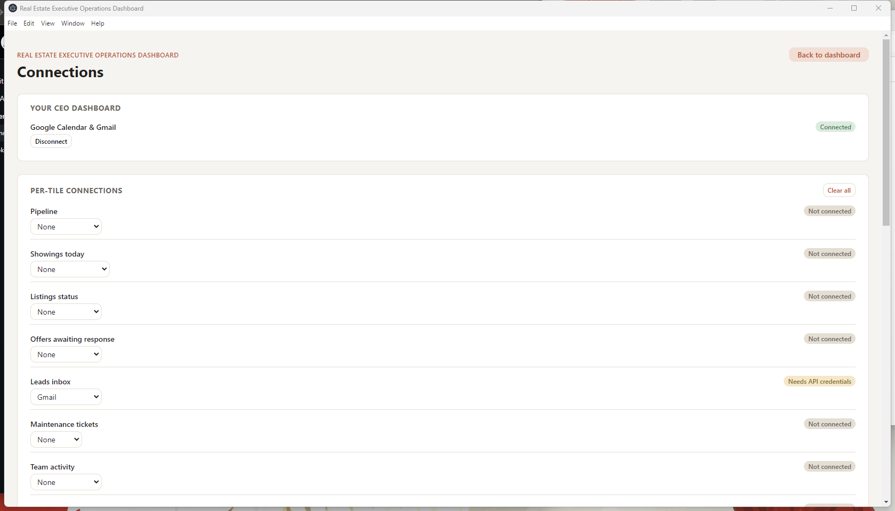

# Realty Ops

**A daily executive dashboard for real estate operators, built as a native desktop app.**

Real estate brokerages run on scattered tools — calendar in one place, email in
another, a CRM nobody fully trusts. Realty Ops pulls the pieces that matter
into one screen a broker actually opens every morning: what's on today,
what's coming up, and what needs attention first — generated automatically
from their real Google Calendar and Gmail, no manual entry.

This repo is a portfolio showcase — screenshots and a write-up only. The
source is closed while the product is pre-revenue.

## Latest release

**0.1.0-alpha.6** — 2026-08-14. [Full release notes](https://github.com/Wiinis/realty-ops/releases/tag/v0.1.0-alpha.6).

### Fixed

- `electron/license.js`'s `BACKEND_URL` fell back to an empty string, and
  its only override was an env var meant for `npm run dev`. That env var
  does not exist on a real end user's machine — a packaged app has no shell
  to inherit it from, and nothing bundles a `.env` file — so every
  previously built installer (including v0.1.0-alpha.5's) shipped with
  license activation and Google connect silently non-functional for a
  normal double-clicked install. The real backend URL is now the hardcoded
  fallback, same pattern as `UPDATE_FEED_TOKEN` in `updater.js`.

## [0.1.0-alpha.3] - 2026-07-28

### Added

- Backend service (`backend/`): license activation/status, Stripe Checkout
  + billing webhooks, Google OAuth (Calendar + Gmail, read-only) with
  token storage and auto-refresh, and `scheduler.mjs` polling every 15
  minutes to generate each connected customer's CEO Dashboard once they
  cross their own local 7am. `dayLine`/`topFive`/`upcomingEvents` are now
  real once a customer activates a license and connects Google — see
  `backend/README.md` and `docs/business/ship-checklist.md`.
- `ceoDashboard.mjs`: generates the CEO Dashboard deterministically from
  Calendar/Gmail data — no LLM, no per-customer API cost. An earlier
  Anthropic Managed Agents version that judged importance across meetings
  and email is preserved on the `managed-agents-pipeline` git branch.
- `npm run start-realty-ops-server`: brings up the backend and a
  Cloudflare Tunnel together for exposing a local backend during a demo,
  waiting for the backend to be healthy before starting the tunnel.
- Connections screen: license activation and a "Connect Google" flow
  (`src/components/Connections.jsx`), talking to the backend via
  `electron/backendClient.js`.
- Legal drafts (`docs/legal/`) and a pricing proposal
  (`docs/business/pricing.md`) — both starting points, not finished
  decisions; see their own inline notes.

## Screenshots

### Today's Brief

Real data, not a mockup — pulled live from a connected Google Calendar. A
day timeline, a ranked Top Five, and the week and month ahead, all generated
without any manual input.

### Connections

Where the Google account gets linked, alongside an honest per-tile status
for the rest of the dashboard's data sources — some tiles ship live, others
are marked plainly as not yet connected rather than faked.

## How it's built

- **Desktop app:** Electron + React (Vite), packaged as native installers
  for Windows and macOS via `electron-builder`. Sandboxed renderer
  (`contextIsolation`, no `nodeIntegration`) — the only bridge to the
  filesystem or network is an explicit preload script.
- **Daily brief generation:** deterministic, not LLM-based. A small backend
  service reads the connected Google Calendar and Gmail directly and shapes
  the brief with fixed rules — today's timed events, a ranked Top Five —
  rather than paying for a model call per customer per day. An
  Anthropic-Managed-Agents-based version that judged importance across
  meetings and email exists on a separate branch, held in reserve for once
  there's revenue to justify the added API cost.
- **Licensing & billing:** license activation, Stripe Checkout and billing
  webhooks, and a background subscription check that shuts the dashboard
  down gracefully (never abruptly) if a subscription lapses.
- **Multi-customer config:** one codebase, one `master` branch. Per-client
  branding, enabled panels, and brief delivery time are all just a config
  file — no per-customer forks.
- **Scheduler that survives real machines:** the daily-delivery timer
  re-arms on a short ceiling and re-reads the wall clock on every wake,
  specifically so it survives a closed laptop lid or a sleep cycle without
  double-firing or silently missing a day.
- **Auto-update & CI/CD:** every tagged release builds signed-pending
  Windows and macOS installers in CI and publishes them straight to GitHub
  Releases; the app checks for updates on startup and installs on next
  restart.
- **Tested:** a `node:test` suite covering the scheduler, config merging,
  connection persistence, and layout logic, plus a cross-platform smoke
  test that launches the packaged app and checks it survives — both gate
  every release.

## Status

Early alpha. The daily brief (calendar, email, Top Five) is real; several of
the dashboard's other panels are still placeholder data pending their own
integrations. Built solo, iterating toward a first paying customer.
